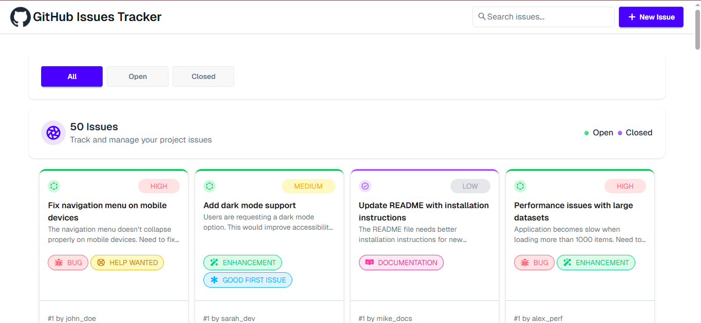

#  GitHub Issue Tracker

> **GitHub Issue Tracker** is a clean and responsive web application to track and manage project issues. Filter by status, search by keyword, and view detailed issue information — all in a simple and intuitive interface.

---

## 🌐 Live Demo

🔗 [Github Issue Tracker](https://github-issue-tracker-app.vercel.app/)

---

##  Preview



---

##  Features

-  **Login Page** — Simple authentication with demo credentials
-  **Issue Dashboard** — View all project issues in a card grid layout
-  **Filter by Status** — Toggle between All / Open / Closed issues
-  **Search Issues** — Search issues by title in real-time
-  **Label Badges** — Color-coded labels (Bug, Help Wanted, Enhancement, Documentation)
-  **Priority Indicators** — High / Medium / Low priority badges
-  **Issue Detail Modal** — Click any card to see full issue details
-  **Loading Spinner** — Shown while fetching data from API
-  **Fully Responsive** — Works on mobile, tablet & desktop

---

## 🛠️ Tech Stack

| Technology | Purpose |
|---|---|
|  **HTML5** | Page structure |
|  **Tailwind CSS v4** | Utility-first styling (via CDN) |
|  **DaisyUI v5** | UI Component library |
|  **Vanilla JavaScript** | DOM manipulation & API calls |
|  **Font Awesome 7** | Icons |
|  **Geist** | Typography (Google Fonts) |
|  **REST API** | Live issue data from external server |

---

## 📁 Project Structure

```
github-issue-tracker/
├── assets/
│   ├── github-logo.png
│   ├── favicon-github.png
│   ├── Aperture.png
│   ├── Open-Status.png
│   └── Closed-Status.png
│
├── styles/
│   ├── style.css              # Custom CSS (font, btn-primary color)
│   └── tailwind_init.css      # Tailwind import
│
├── script/
│   ├── home.js                # Issue fetching, filtering, search, modal
│   └── login.js               # Login validation & redirect
│
├── index.html                 # Login page
└── home.html                  # Issue dashboard
```

---

## 🚀 Getting Started

**1. Clone the repository**
```bash
git clone https://github.com/IamPial/github-issue-tracker.git
cd github-issue-tracker
```

**2. Open in browser**

Open `index.html` directly in your browser or use VS Code Live Server.

```
index.html → home.html
```

> ⚠️ Use **Live Server** for API calls to work correctly. Opening the file directly may cause CORS issues.

---

## 🔐 Demo Credentials

| Field | Value |
|---|---|
| Username | `admin` |
| Password | `admin123` |

---

## 🌐 API Reference

Base URL: `https://phi-lab-server.vercel.app/api/v1/lab`

| Endpoint | Method | Description |
|---|---|---|
| `/issues` | GET | Fetch all issues |
| `/issue/:id` | GET | Fetch a single issue by ID |
| `/issues/search?q=keyword` | GET | Search issues by keyword |

---

## ⚙️ Key Functionality

### Login (`login.js`)
- Validates username and password fields
- Redirects to `home.html` on successful login

### Issue Dashboard (`home.js`)
- **`loadIssues()`** — Fetches all issues on page load
- **`showActive(id)`** — Filters issues by All / Open / Closed
- **`showAllIssues(issues)`** — Renders issues as cards in the grid
- **`generateBadgeStatus(labels)`** — Generates color-coded label badges
- **`loadSingleIssues(id)`** — Fetches details of a single issue
- **`displayModal(obj)`** — Displays issue details inside a modal
- **`searchIssues(text)`** — Sends a search request to the API

---

## 🤝 Contributing

1. Fork the repository
2. Create a branch: 
3. Commit: 
4. Push: 
5. Open a Pull Request

---

## 📄 License

This project is licensed under the [MIT License](./LICENSE).

---

##  Author

**Pial Uddin**
- GitHub: [@IamPial](https://github.com/IamPial)
- LinkedIn: [Linkedin](https://linkedin.com/in/pial-uddin)
